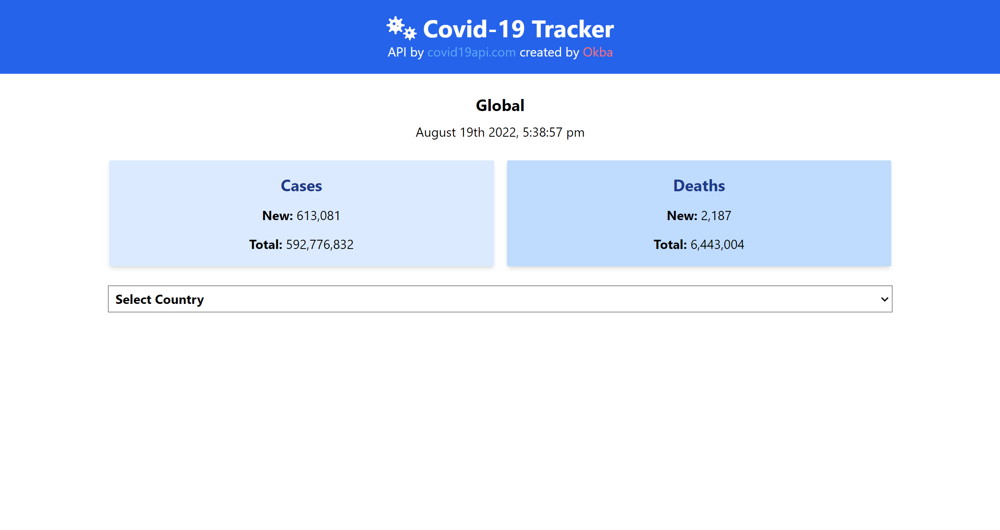

# Covid 19 Tracker Project

Covid 19 Tracker WebSite Project Using covid19api.com VueJS and TailwindCss along with postcss i used also moment js for date formating, for smaller countries you will see 0 cases sometimes because there's no "new news" but like big countries you will see cases.



## Project setup
```
npm install
```

### Compiles and hot-reloads for development
```
npm run serve
```

### Compiles and minifies for production
```
npm run build
```

### Customize configuration
See [Configuration Reference](https://cli.vuejs.org/config/).

Note: ALL RIGHTS RESERVED FOR THE IDEA OWNER.